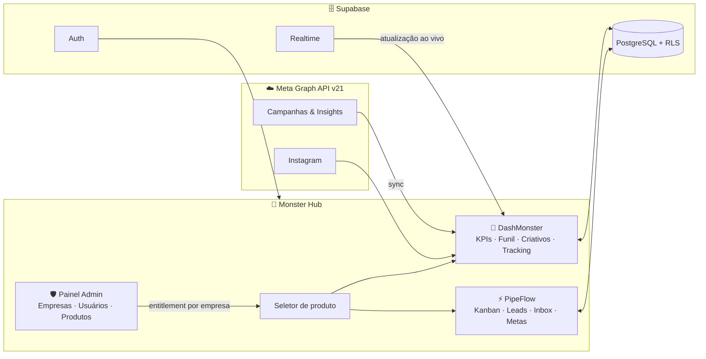

<div align="center">

# 🐉 Monster Hub

[](https://git.io/typing-svg)

### A plataforma que junta **tráfego pago** e **vendas** no mesmo lugar.

[](https://vercel.com/new/clone?repository-url=https://github.com/BryanJohn2901/dashmonster)
[](https://nextjs.org)
[](https://react.dev)
[](https://supabase.com)
[](https://developers.facebook.com)
[](https://tailwindcss.com)
[](LICENSE)

<br/>

**🐉 DashMonster** `Analytics · Meta Ads` &nbsp;•&nbsp; **⚡ PipeFlow** `CRM · Social Selling` &nbsp;•&nbsp; **🛡️ Painel Admin** `Multi-empresa`

</div>

---

## 🎯 O objetivo

Quem vive de tráfego pago vive **dividido em dez abas**: Gerenciador de Anúncios numa, planilha noutra, CRM na terceira, WhatsApp na quarta — e no fim do dia ninguém sabe dizer *quanto custou o lead que virou venda*.

O Monster Hub existe pra fechar esse ciclo num lugar só:

> **Anúncio → Lead → Negociação → Venda → ROAS real.**

Uma conta, uma empresa (ou várias), e os dois lados da operação conversando: o **DashMonster** mostra o que os anúncios estão fazendo, o **PipeFlow** mostra o que o comercial está fazendo com isso.

---

## 😩 Antes / 🐉 Depois

<table>
<tr>
<td width="50%">

**😩 Sem Monster Hub**

- Exporta relatório no Gerenciador de Anúncios
- Cola na planilha, formata coluna, calcula ROAS à mão
- Lead chega no Instagram e morre no direct
- Follow-up anotado em caderno / na cabeça
- Cada cliente da agência = um ritual manual diferente
- Ninguém sabe qual campanha gerou a venda de ontem

</td>
<td width="50%">

**🐉 Com Monster Hub**

- Token da Meta uma vez → métricas em tempo real
- ROAS, CPA, ROI, CTR e funil calculados sozinhos
- Lead cai direto no Kanban com origem rastreada
- Follow-up com atividades, playbooks e calendário
- Cada empresa isolada, com seu time e seus acessos
- Dashboard de metas cruzando anúncio ↔ venda

</td>
</tr>
</table>

---

## 📈 O que muda no dia a dia

| Rotina | Antes | Depois |
|---|---|---|
| Relatório semanal de tráfego | ~2 h de export + planilha | **0 min** — dashboard vivo |
| Calcular ROAS/CPA por campanha | Fórmula manual, sujeita a erro | **Automático**, por conta/campanha/conjunto |
| Lead novo do Instagram | Direct perdido no meio de 200 | **Card no Kanban** com histórico |
| Follow-up de proposta | "Depois eu lembro" | **Atividade agendada** + notificação |
| Onboarding de cliente novo (agência) | Setup manual repetido | **Wizard de empresa** no painel admin |
| Controle de quem acessa o quê | Senha compartilhada 🙈 | **Papéis + produtos por membro** |

### E no nível da empresa

- **Agências:** cada cliente é uma empresa isolada (RLS no banco, não filtro de front). Token Meta, contas de anúncio, filtros e time — tudo por empresa, provisionado num wizard.
- **Infoprodutores:** lançamento, perpétuo e evento com histórico multi-fonte (Meta + planilha de leads + Eduzz) e total *blended* com quebra por canal.
- **Comercial:** pipeline visual, inbox integrada, metas do mês e taxa de conversão por etapa — sem "me manda o status por áudio".
- **Gestão:** auditoria de login (quem entrou, quando, de onde, por qual dispositivo), banimento com um clique e liberação de produto por empresa e por pessoa.

---

## 🧩 Como funciona



O fluxo em uma linha: o super admin **libera produtos por empresa** no painel; cada membro entra no hub e vê **só o que a empresa dele contratou** (e só o que o papel dele permite); os dados ficam **isolados por empresa via RLS** direto no PostgreSQL.

---

## 🐉 DashMonster — Analytics de Meta Ads

| | |
|---|---|
| 📊 **KPIs em tempo real** | ROAS, CPA, ROI, CTR, frequência, investimento — por conta, campanha e conjunto, com drill-down |
| 🔄 **Sync com um clique** | Token da Meta (ou OAuth "Conectar Facebook") + `act_...` → dados no dashboard em segundos |
| 🎨 **Análise de criativos** | Preview de anúncio, thumbnail de vídeo, oEmbed do Instagram — o que roda e o que converte |
| 🧭 **Perfil de anunciante** | Intenção → tipo de resultado: lançamento, perpétuo, evento — cada um com suas métricas |
| 🧮 **Multi-fonte** | Meta + planilha de leads + Eduzz num total blended com quebra por canal |
| 🎯 **Tracking próprio** | Pixel primário, eventos server-side (CAPI), UTMs e funis — sem depender só do pixel da Meta |
| 📚 **Histórico** | Abas por tipo de campanha (customizáveis por empresa), metas e comparativos |

## ⚡ PipeFlow — CRM para social selling

| | |
|---|---|
| 📋 **Kanban de negócios** | Funis com etapas coloridas, arrastar-e-soltar, valor por etapa e motivo de ganho/perda |
| 👥 **Gestão de leads** | Ficha completa, campos personalizados, tags, detecção de duplicados e histórico de toda interação |
| 💬 **Inbox integrada** | Conversas ligadas ao lead — o contexto da venda no mesmo lugar da negociação |
| 📆 **Calendário & atividades** | Follow-ups, tarefas e playbooks (sequências prontas de atividades por etapa) |
| 📈 **Dashboard comercial** | Metas do mês, conversão por etapa, leads novos vs. fechados |
| 🔌 **API & Webhooks** | Tokens de API e webhooks de entrada/saída pra plugar no que a empresa já usa |

## 🛡️ Painel Admin — a empresa no controle

| | |
|---|---|
| 🏢 **Empresas** | Criação por wizard, renomear, personalização com **banner + logo + descrição** (estilo WhatsApp Business) |
| 📦 **Produtos & acessos** | Liga/desliga DashMonster e PipeFlow **por empresa** — e restringe **por membro** |
| 👤 **Usuários & papéis** | Editar nome/e-mail/foto, papéis (dono, gestor, visualizador), **banir/desbanir**, último acesso, IP e dispositivo |
| ✉️ **Convites** | Por e-mail: quem já tem conta entra na hora; quem não tem ativa ao se cadastrar |
| 🔑 **Integrações** | Token Meta por empresa, **descoberta automática das contas de anúncio** visíveis pelo token (app + BM), Instagram |
| ⚡ **PipeFlow por empresa** | Funis, etapas e volume de negócios de qualquer empresa, direto do painel |

---

## 🔐 Segurança de verdade, não de fachada

- **RLS no PostgreSQL** — isolamento por empresa acontece no banco, não no front. Membro só lê a empresa dele; super admin tem policies próprias.
- **Trigger de entitlement** — nem o dono da empresa consegue se auto-liberar um produto; só super admin (validado no banco).
- **Rotas de API fechadas** — `requireAuth` + Bearer token em tudo; token da Meta viaja em header, nunca em query string.
- **Service role só no servidor** — operações administrativas (banir, trocar e-mail) passam por rota com gate de super admin.
- **Auditoria de login** — cada acesso registrado com IP, dispositivo e localização.

---

## 🚀 Setup

### Pré-requisitos
- Node.js >= 22
- Conta no [Supabase](https://supabase.com) (grátis)
- [Token da Meta Graph API](https://developers.facebook.com) — use **System User Token** para não expirar

### 1. Clone e instale

```bash
git clone https://github.com/BryanJohn2901/dashmonster.git
cd dashmonster
npm install
```

### 2. Variáveis de ambiente

```bash
cp .env.example .env.local
```

```env
NEXT_PUBLIC_SUPABASE_URL=https://xxxx.supabase.co
NEXT_PUBLIC_SUPABASE_ANON_KEY=eyJxxxx...
SUPABASE_SERVICE_ROLE_KEY=eyJxxxx...   # rotas admin (banimento, e-mail, login events)
```

### 3. Migrations no Supabase

Acesse **Supabase → SQL Editor** e rode os arquivos de `supabase/migrations/` **em ordem numérica** (`001` → `075`). Marcos importantes:

| Migration | O que habilita |
|---|---|
| `001–009` | Base do DashMonster (métricas, criativos, categorias) |
| `021` | Multi-empresa (companies + RLS por membro) |
| `025–026` | Convites por e-mail + super admin |
| `071` | Entitlement de produtos por empresa (trigger) |
| `072–073` | Schema completo do PipeFlow CRM |
| `074` | Auditoria de logins |
| `075` | Super admin enxerga o CRM de todas as empresas |

### 4. Rode

```bash
npm run dev
# http://localhost:3000
```

### 5. Primeiros passos no app

1. Crie sua conta e insira seu usuário em `app_admins` (vira super admin)
2. `/admin` → **Criar empresa** (wizard: nome, filtros, time)
3. **Conexão Meta** → cole o token (ou use o OAuth "Conectar Facebook")
4. **Contas de anúncio** → **Carregar contas** e adicione as que quiser
5. **Produtos & acessos** → ligue DashMonster e/ou PipeFlow
6. Volte pro hub e abra o produto ✅

---

## ☁️ Deploy na Vercel

[](https://vercel.com/new/clone?repository-url=https://github.com/BryanJohn2901/dashmonster)

Após importar, configure em **Settings → Environment Variables**:

```
NEXT_PUBLIC_SUPABASE_URL
NEXT_PUBLIC_SUPABASE_ANON_KEY
SUPABASE_SERVICE_ROLE_KEY
```

> ⚠️ Plano Hobby da Vercel só aceita **cron diário** — não configure cron sub-diário no `vercel.json`.

---

## 🛠️ Stack

| Camada | Tecnologia |
|---|---|
| Framework | Next.js 16.2 (App Router + Turbopack) |
| UI | React 19 + Tailwind CSS v4 + Radix UI |
| Banco | Supabase (PostgreSQL + RLS + Realtime) |
| Auth | Supabase Auth (+ GoTrue admin p/ banimento) |
| Gráficos | Recharts |
| Ícones | Lucide React |
| APIs externas | Meta Ads Graph API v21 · Instagram · Eduzz |
| Deploy | Vercel |

---

## 📁 Estrutura

```
src/
├── app/
│   ├── page.tsx              # Hub: auth → empresa → produto → Dash
│   ├── admin/                # Painel Admin (super admin / DEV)
│   ├── crm/                  # PipeFlow: pipeline, leads, inbox, calendário
│   └── api/
│       ├── meta/             # Proxy autenticado da Graph API
│       ├── instagram/        # Contas, insights e OAuth do IG
│       ├── tracking/         # Pixel próprio, CAPI, webhooks
│       ├── admin/users/      # Gestão de usuários (service role)
│       └── eduzz/            # Webhook de vendas Eduzz
├── components/
│   ├── Dashboard.tsx         # KPIs, gráficos, filtros, funil
│   ├── ProductSelectScreen.tsx  # Monster Hub (seletor de produto)
│   ├── admin/                # Seções do Painel Admin
│   ├── pipeline/ leads/ inbox/  # UI do PipeFlow
│   └── ui/                   # Primitivos (Radix + Tailwind)
├── hooks/
│   └── useCompany.ts         # Tenancy: empresas, papéis, produtos, branding
├── lib/
│   ├── crm.ts                # Fachada do CRM (Supabase ⇄ demo)
│   └── trackingAuth.ts       # requireAuth das rotas de API
└── supabase/migrations/      # Schema SQL versionado (001–075)
```

---

## 🤝 Contribuindo

1. Fork o projeto
2. Crie uma branch: `git checkout -b feature/minha-feature`
3. Commit: `git commit -m 'feat: minha feature'`
4. Push: `git push origin feature/minha-feature`
5. Abra um Pull Request

---

<div align="center">
  <br/>
  <strong>🐉 Feito para quem leva tráfego — e venda — a sério.</strong>
  <br/><br/>
  <sub>Dados reais. Decisões reais. Resultado real.</sub>
  <br/><br/>

  

</div>
