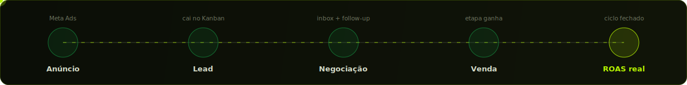
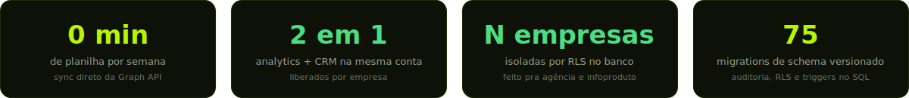
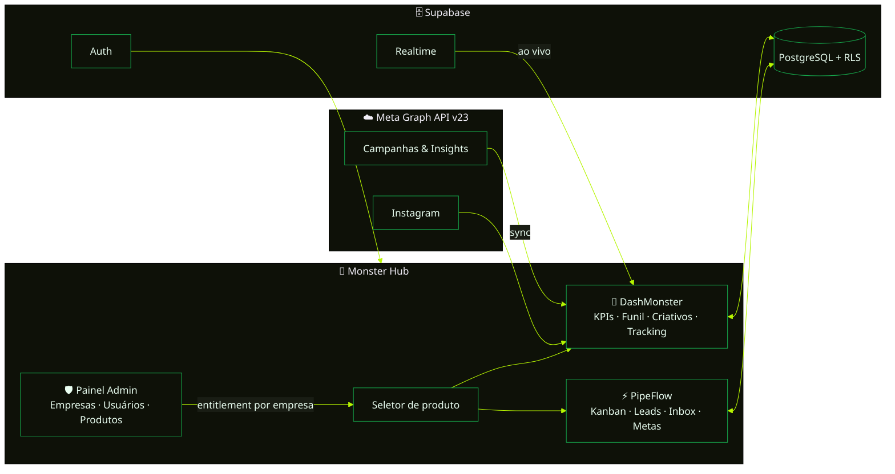

<div align="center">



<br/><br/>

[](https://nextjs.org)
[](https://react.dev)
[](https://supabase.com)
[](https://developers.facebook.com)
[](https://tailwindcss.com)
[](https://vercel.com/new/clone?repository-url=https://github.com/BryanJohn2901/dashmonster)

<br/>

*Quem vive de tráfego vive dividido em dez abas.*
*O Monster Hub fecha o ciclo num lugar só:*



</div>

<br/>

## O objetivo

O Gerenciador de Anúncios sabe quanto você **gastou**. A planilha sabe o que você **copiou dela**. O CRM — quando existe — sabe o que o comercial **lembrou de anotar**. Nenhum dos três conversa entre si, e a pergunta que paga as contas fica sem resposta: **qual campanha gerou a venda de ontem?**

O Monster Hub junta os dois lados da operação numa conta só: o **DashMonster** mostra o que os anúncios estão fazendo, o **PipeFlow** mostra o que o comercial está fazendo com isso — e o **Painel Admin** decide quem acessa o quê, empresa por empresa, pessoa por pessoa.

<div align="center">
<br/>

<br/>
</div>

## O que muda no dia a dia

| Rotina | Antes | Com o Monster Hub |
|---|---|---|
| Relatório semanal de tráfego | ~2 h de export + planilha | **Dashboard vivo** — 0 min |
| ROAS / CPA por campanha | Fórmula manual, sujeita a erro | **Calculado automático**, com drill-down até o conjunto |
| Lead novo do Instagram | Direct perdido no meio de 200 | **Card no Kanban** com origem e histórico |
| Follow-up de proposta | "Depois eu lembro" | **Atividade agendada** + playbook + notificação |
| Cliente novo na agência | Ritual manual repetido | **Wizard de empresa**: filtros, time e token em minutos |
| Controle de acesso | Senha compartilhada 🙈 | **Papéis + produtos por membro**, banimento com um clique |

<table>
<tr>
<td width="25%" valign="top">

**🏢 Agências**

Cada cliente é uma empresa isolada — **RLS no banco**, não filtro de front. Token, contas, filtros e time por empresa.

</td>
<td width="25%" valign="top">

**🚀 Infoprodutores**

Lançamento, perpétuo e evento com histórico **multi-fonte** (Meta + planilha + Eduzz) e total blended por canal.

</td>
<td width="25%" valign="top">

**💼 Comercial**

Pipeline visual, inbox integrada, metas do mês e conversão por etapa — sem *"me manda o status por áudio"*.

</td>
<td width="25%" valign="top">

**🛡️ Gestão**

Auditoria de login (quem, quando, de onde, qual device), banimento e liberação de produto por pessoa.

</td>
</tr>
</table>

<div align="center"></div>

## Os três pilares

### 🐉 DashMonster — `Analytics · Meta Ads`

| | |
|---|---|
| 📊 **KPIs em tempo real** | ROAS, CPA, ROI, CTR, frequência e investimento — por conta, campanha e conjunto |
| 🔄 **Sync com um clique** | Token da Meta (ou OAuth *Conectar Facebook*) → dados no dashboard em segundos |
| 🎨 **Análise de criativos** | Preview de anúncio, thumb de vídeo, oEmbed do Instagram — o que roda e o que converte |
| 🧭 **Perfil de anunciante** | Intenção → resultado: lançamento, perpétuo e evento, cada um com suas métricas |
| 🎯 **Tracking próprio** | Pixel primário, eventos server-side (CAPI), UTMs e funis — independente do pixel da Meta |
| 🧮 **Multi-fonte** | Meta + planilha de leads + Eduzz num total blended com quebra por canal |

### ⚡ PipeFlow — `CRM · Social Selling`

| | |
|---|---|
| 📋 **Kanban de negócios** | Funis com etapas coloridas, drag-and-drop, valor por etapa, motivo de ganho/perda |
| 👥 **Gestão de leads** | Ficha completa, campos personalizados, tags, duplicados detectados, histórico integral |
| 💬 **Inbox integrada** | Conversa ligada ao lead — o contexto da venda no mesmo lugar da negociação |
| 📆 **Calendário & playbooks** | Follow-ups, tarefas e sequências prontas de atividades por etapa |
| 📈 **Dashboard comercial** | Metas do mês, conversão por etapa, leads novos vs. fechados |
| 🔌 **API & Webhooks** | Tokens de API e webhooks de entrada/saída pra plugar no que a empresa já usa |

### 🛡️ Painel Admin — `Multi-empresa`

| | |
|---|---|
| 🏢 **Empresas** | Wizard de criação + personalização com **banner, logo e descrição** (estilo WhatsApp Business) |
| 📦 **Produtos & acessos** | Liga/desliga Dash e Pipe **por empresa** — e restringe **por membro** |
| 👤 **Usuários & papéis** | Editar nome/e-mail/foto, papéis, **banir/desbanir**, último acesso, IP e dispositivo |
| ✉️ **Convites** | Por e-mail: quem tem conta entra na hora, quem não tem ativa ao se cadastrar |
| 🔑 **Integrações** | Token Meta por empresa + **descoberta automática das contas de anúncio** do app/BM |
| ⚡ **CRM por empresa** | Funis, etapas e volume de negócios de qualquer empresa, direto do painel |

<div align="center"></div>

## Arquitetura



O fluxo em uma linha: o super admin **libera produtos por empresa**; cada membro vê **só o que a empresa contratou** (e só o que o papel dele permite); os dados ficam **isolados por RLS** direto no PostgreSQL — o front nunca é a única barreira.

## Segurança de verdade, não de fachada

- **RLS no PostgreSQL** — isolamento por empresa no banco. Membro só lê a empresa dele; super admin tem policies próprias e auditáveis.
- **Trigger de entitlement** — nem o dono da empresa se auto-libera um produto; a trava é no banco, não no botão.
- **Rotas fechadas** — `requireAuth` + Bearer em todas as APIs; token da Meta viaja em header, nunca em query string.
- **Service role só no servidor** — banir usuário e trocar e-mail passam por rota com gate de super admin.
- **Auditoria de login** — cada acesso registrado com IP, dispositivo e localização.

<div align="center"></div>

## Comece em 5 passos

```bash
git clone https://github.com/BryanJohn2901/dashmonster.git
cd dashmonster && npm install
cp .env.example .env.local   # preencha as 3 chaves do Supabase
npm run dev                   # http://localhost:3000
```

```env
NEXT_PUBLIC_SUPABASE_URL=https://xxxx.supabase.co
NEXT_PUBLIC_SUPABASE_ANON_KEY=eyJxxxx...
SUPABASE_SERVICE_ROLE_KEY=eyJxxxx...   # rotas admin (banimento, e-mail, auditoria)
```

<details>
<summary><b>🗄️ Migrations no Supabase</b> — rode <code>supabase/migrations/</code> em ordem numérica (001 → 075)</summary>
<br/>

| Migration | O que habilita |
|---|---|
| `001–009` | Base do DashMonster (métricas, criativos, categorias) |
| `021` | Multi-empresa (companies + RLS por membro) |
| `025–026` | Convites por e-mail + super admin |
| `071` | Entitlement de produtos por empresa (trigger) |
| `072–073` | Schema completo do PipeFlow CRM |
| `074` | Auditoria de logins |
| `075` | Super admin enxerga o CRM de todas as empresas |

</details>

<details>
<summary><b>⚙️ Primeiros passos no app</b></summary>
<br/>

1. Crie sua conta e insira seu usuário em `app_admins` (vira super admin)
2. `/admin` → **Criar empresa** (wizard: nome, filtros, time)
3. **Conexão Meta** → cole o token (ou use o OAuth *Conectar Facebook*)
4. **Contas de anúncio** → **Carregar contas** e adicione as que quiser
5. **Produtos & acessos** → ligue DashMonster e/ou PipeFlow → abra pelo hub ✅

</details>

<details>
<summary><b>☁️ Deploy na Vercel</b></summary>
<br/>

[](https://vercel.com/new/clone?repository-url=https://github.com/BryanJohn2901/dashmonster)

Configure em **Settings → Environment Variables**: `NEXT_PUBLIC_SUPABASE_URL`, `NEXT_PUBLIC_SUPABASE_ANON_KEY`, `SUPABASE_SERVICE_ROLE_KEY`.

> ⚠️ Plano Hobby só aceita **cron diário** — não configure cron sub-diário no `vercel.json`.

</details>

<details>
<summary><b>📁 Estrutura do projeto</b></summary>
<br/>

```
src/
├── app/
│   ├── page.tsx              # Hub: auth → empresa → produto → Dash
│   ├── admin/                # Painel Admin (super admin / DEV)
│   ├── crm/                  # PipeFlow: pipeline, leads, inbox, calendário
│   └── api/
│       ├── meta/             # Proxy autenticado da Graph API
│       ├── instagram/        # Contas, insights e OAuth do IG
│       ├── tracking/         # Pixel próprio, CAPI, webhooks
│       ├── admin/users/      # Gestão de usuários (service role)
│       └── eduzz/            # Webhook de vendas Eduzz
├── components/
│   ├── Dashboard.tsx         # KPIs, gráficos, filtros, funil
│   ├── ProductSelectScreen.tsx  # Monster Hub (seletor de produto)
│   ├── admin/                # Seções do Painel Admin
│   ├── pipeline/ leads/ inbox/  # UI do PipeFlow
│   └── ui/                   # Primitivos (Radix + Tailwind)
├── hooks/
│   └── useCompany.ts         # Tenancy: empresas, papéis, produtos, branding
├── lib/
│   ├── crm.ts                # Fachada do CRM (Supabase ⇄ demo)
│   └── trackingAuth.ts       # requireAuth das rotas de API
└── supabase/migrations/      # Schema SQL versionado (001–075)
```

</details>

## Stack

| Camada | Tecnologia |
|---|---|
| Framework | Next.js 16.2 (App Router + Turbopack) |
| UI | React 19 · Tailwind CSS v4 · Radix UI |
| Banco | Supabase (PostgreSQL + RLS + Realtime) |
| Auth | Supabase Auth (+ GoTrue admin p/ banimento) |
| Gráficos | Recharts |
| APIs externas | Meta Ads Graph API v23 · Instagram · Eduzz |
| Deploy | Vercel |

## Contribuindo

`fork` → `git checkout -b feature/minha-feature` → `git commit -m 'feat: minha feature'` → `git push` → Pull Request.

<br/>

<div align="center">


<br/>

**🐉 Feito para quem leva tráfego — e venda — a sério.**

<sub>Dados reais. Decisões reais. Resultado real.</sub>

<br/><br/>

<sub>Desenvolvido e assinado por <strong>GSAStúdio</strong> · <a href="https://gsaweb.com.br">gsaweb.com.br</a></sub>

</div>
